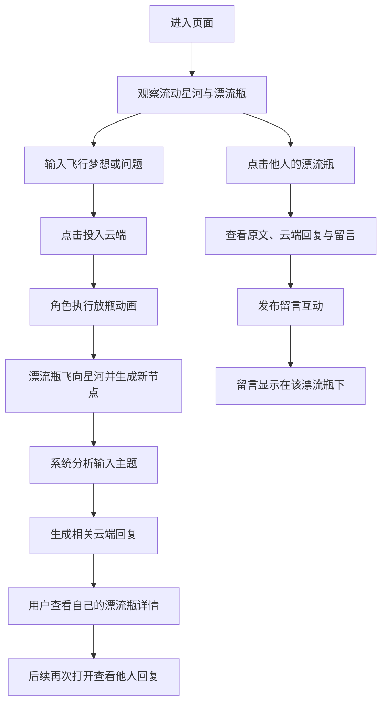

## 1. 产品概述
“航空梦想漂流瓶”是一个沉浸式单页互动网页，用户把与飞行相关的梦想、问题或心愿投入流动星河，云端会基于内容返回有针对性的回复，并允许其他访客继续参与回应。
- 目标用户是对航空、飞行、宇宙氛围和轻社交互动感兴趣的普通访客、学生与航空爱好者。
- 产品价值在于把“许愿 + 提问 + 被回应 + 围观互动”整合成一个具有观赏性、神秘感与情绪价值的网页体验。

## 2. 核心功能

### 2.1 功能模块
1. **主页面**：星河背景、卡通人物放瓶动作、梦想输入区、投放入口、流动星河漂流瓶区域。
2. **漂流瓶详情弹层**：查看瓶子内容、查看云端回复、查看后续留言、发布留言。
3. **我的漂流瓶面板**：查看自己发布过的漂流瓶、快速打开详情、关注后续互动。

### 2.2 页面详情
| 页面名称 | 模块名称 | 功能描述 |
|-----------|-------------|---------------------|
| 主页面 | 顶部氛围头图 | 以“星河航迹”主题呈现标题、副标题和引导文案，建立沉浸感。 |
| 主页面 | 用户卡通角色区 | 展示卡通化飞行梦想家角色，投放时触发抬手、助跑、放飞漂流瓶等动画。 |
| 主页面 | 梦想输入区 | 用户输入关于飞行的梦想、问题、计划或困惑，支持字数提示与空内容校验。 |
| 主页面 | 投入云端按钮 | 点击后触发投放动画、生成新漂流瓶、插入星河、同步生成云端智能回复。 |
| 主页面 | 流动星河场景 | 以动态银河、星尘、流光、漂流瓶漂浮轨迹构成主视觉；瓶子默认只展示外观，点击后才查看内容。 |
| 主页面 | 星河瓶子交互 | 不同漂流瓶随机分布与缓慢漂移，悬浮高亮，点击打开详情。 |
| 主页面 | 我的漂流瓶面板 | 展示自己投放过的瓶子摘要、云端状态、留言数量和最近互动。 |
| 漂流瓶详情弹层 | 原始内容区 | 显示发瓶人的文本内容、发布时间、身份标签、主题关键词。 |
| 漂流瓶详情弹层 | 云端回复区 | 根据用户输入语义进行分类匹配，生成偏相关的名言、冷知识、建议、鼓励或下一步行动提示。 |
| 漂流瓶详情弹层 | 留言列表区 | 展示其他人对该漂流瓶的回复，支持多条累积，区分“云端回复”和“旅人回复”。 |
| 漂流瓶详情弹层 | 留言输入区 | 允许当前访客对别人的漂流瓶或自己的漂流瓶继续留言。 |

## 3. 核心流程
用户进入页面后先被流动星河与卡通人物吸引，在输入区写下与飞行相关的梦想或疑问，点击“投入云端”后，角色执行放瓶动作，瓶子沿航迹飞向天空并进入星河。系统根据输入内容生成相关回复，随后该漂流瓶会作为可点击对象停留在银河中。用户可以点开任意瓶子查看其内容、云端回复和其他人的留言，也可以继续留言互动。自己的漂流瓶除了能立即看到云端回复，还能在后续打开时查看他人的新回复。

## 4. 用户界面设计
### 4.1 设计风格
- 主色调：午夜蓝、极光紫、星云金、冰川青，强调深空与航空幻想感。
- 按钮风格：圆角胶囊按钮，带流光边缘、内发光和悬停抬升反馈。
- 字体建议：标题使用具有未来感和戏剧性的展示字体，正文字体使用易读的中文无衬线字体。
- 布局风格：桌面优先的双栏结构，左侧为投放控制与“我的漂流瓶”，右侧为沉浸式星河场景。
- 图标风格：采用卡通宇航员、玻璃漂流瓶、星屑、飞机航迹等拟物与插画融合风格。

### 4.2 页面设计概览
| 页面名称 | 模块名称 | UI 元素 |
|-----------|-------------|-------------|
| 主页面 | 顶部头图 | 渐变标题字、星轨装饰、朦胧玻璃卡片、缓慢闪烁的星尘。 |
| 主页面 | 角色区 | 卡通人物、动态围巾或飞行服细节、投放动作关键帧动画。 |
| 主页面 | 输入区 | 发光文本框、提示文案、字数状态、带航迹尾流的提交按钮。 |
| 主页面 | 星河场景 | 流动型银河带、漂移星尘、可点击漂流瓶、景深雾层、流星拖尾。 |
| 主页面 | 我的漂流瓶 | 玻璃拟态列表卡片、互动计数、最近回复预览。 |
| 详情弹层 | 内容与回复 | 大号瓶身卡片、云端回信高亮区、留言气泡、时间与身份标签。 |

### 4.3 响应式
- 采用桌面优先设计，重点保证大屏下星河场景的观赏性与瓶子分布密度。
- 平板与手机需自动切换为纵向布局，输入区与我的漂流瓶上移，星河区域下沉。
- 触屏设备中瓶子点击范围需放大，弹层内容区可滚动，按钮保留明显点击反馈。

### 4.4 动效与场景指引
- 背景环境：表现为缓慢流动的星河，不是静态星空，需有横向或斜向流动感。
- 光效设置：加入星云漫射光、瓶身高光、按钮内发光与角色轮廓光。
- 构图焦点：让卡通角色和最近投出的漂流瓶形成视线引导，强化“放飞”动作。
- 交互动效：瓶子从人物手边抛出，沿曲线飞入星河；打开瓶子时弹层柔和放大出现。
- 后期效果：可加入轻微噪点、模糊雾层、流光线条与星屑粒子，但需控制性能。
