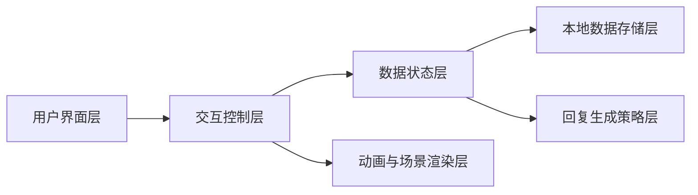
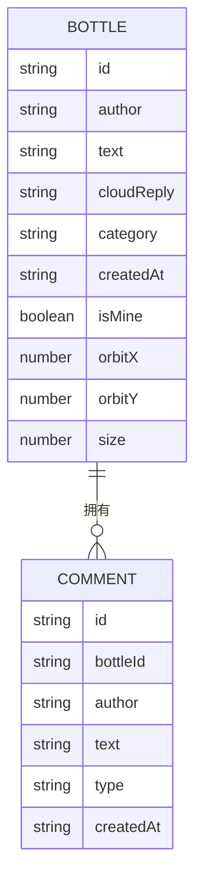

## 1. 架构设计


## 2. 技术描述
- 前端：原生 HTML + CSS + JavaScript，基于单文件页面重构现有 `aviation_dream_bottle.html`
- 初始化方式：无需额外构建工具，直接浏览器打开即可运行
- 数据存储：使用内存数据结构 + `localStorage` 持久化模拟社区数据
- 后端：无，全部交互逻辑在前端本地完成
- 回复策略：基于关键词分类、语义标签映射和回复模板池生成相关回复

## 3. 路由定义
| 路由 | 用途 |
|-------|---------|
| /aviation_dream_bottle.html | 航空梦想漂流瓶主页面，包含投放、浏览、详情和留言功能 |

## 4. 核心模块定义
| 模块 | 职责 |
|------|------|
| 场景初始化模块 | 初始化星河背景、漂流瓶位置、星尘粒子和角色初始状态 |
| 漂流瓶数据模块 | 维护瓶子列表、我的瓶子、留言列表、时间戳和主题标签 |
| 回复生成模块 | 根据输入内容分类，生成与飞行主题相关的回复文本 |
| 动画模块 | 负责角色投放动画、瓶子飞行曲线、星河流动和弹层过渡 |
| 弹层交互模块 | 打开漂流瓶详情、渲染云端回复、展示留言并提交新留言 |
| 持久化模块 | 将瓶子与留言同步到 `localStorage`，刷新后仍可查看 |

## 5. 数据模型
### 5.1 数据模型定义


### 5.2 数据结构说明
```ts
type Bottle = {
  id: string;
  author: string;
  text: string;
  cloudReply: string;
  category: string;
  createdAt: string;
  isMine: boolean;
  orbitX: number;
  orbitY: number;
  size: number;
  comments: CommentItem[];
};

type CommentItem = {
  id: string;
  bottleId: string;
  author: string;
  text: string;
  type: "traveler" | "cloud";
  createdAt: string;
};
```

## 6. 回复生成策略
- 将输入内容按“飞行梦想 / 成为飞行员 / 航空知识疑问 / 旅行愿望 / 设计发明 / 情绪鼓励”进行多关键词匹配。
- 每个主题提供多组模板，避免每次回复重复，增强神秘感。
- 若输入中包含明显问题语气，优先返回解释型或建议型内容。
- 若输入中包含情绪化表达，如“害怕”“担心”“不敢”，优先返回鼓励与行动建议。
- 若无法明确识别主题，则返回泛航空意象类温柔鼓励内容。

## 7. 视觉与交互实现要点
- 使用多层渐变、模糊光晕和伪元素构建流动型星河，不依赖外部图片。
- 漂流瓶以绝对定位方式在星河中漂移，叠加不同的动画延迟与速度，形成漂流感。
- 卡通角色采用纯 CSS 形状或插画式组合结构，避免只用单个 emoji，体现“举瓶、投掷、望向天空”的动作。
- 漂流瓶详情以模态弹层承载，区分“云端回复”和“旅人留言”视觉层级。
- 互动数据刷新后保持存在，便于用户再次查看自己瓶子的后续留言。

## 8. 开发步骤
1. 重构页面结构，建立标题区、人物区、输入区、我的漂流瓶区、星河舞台区和详情弹层。
2. 重写视觉系统，构建流动星河、玻璃瓶、卡通角色与整体发光氛围。
3. 实现投瓶动画链路，包括按钮状态、角色动作、飞行曲线和新增瓶子入场。
4. 完成内容相关回复生成逻辑，并准备多主题回复池。
5. 完成漂流瓶详情和留言功能，支持查看自己的后续互动与评论他人。
6. 接入 `localStorage`，让样例瓶子、我的瓶子和留言持久化。
7. 自测交互流程、视觉层级、滚动与弹层体验，修复样式和脚本问题。
